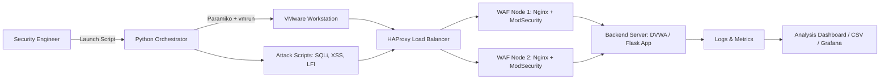

# 🛡️ WAFShield — Automated Web App Security Testing & WAF Validation Platform

> *Attack. Detect. Tune. Automate.*

**WAFShield** is a fully automated platform for testing and validating **Web Application Firewall (WAF)** efficacy against real-world attacks like SQLi, XSS, and LFI. It simulates enterprise-grade infrastructure with **HAProxy load balancing**, **dual WAF layers (Nginx + ModSecurity)**, and orchestrates repeatable attack campaigns via **Python + VMware automation** — perfect for CI/CD pipelines, red team drills, or WAF rule tuning.

---

## 🚀 Features

✅ **Real-World Attack Simulation**  
Automatically launches **SQL Injection**, **XSS**, **Local File Inclusion (LFI)**, and other OWASP Top 10 attacks using Python scripts — tests if your WAF actually blocks them.

✅ **Enterprise-Grade WAF Architecture**  
Deploys **HAProxy** for load balancing + **dual Nginx + ModSecurity WAF nodes** — mirrors real production environments for accurate testing.

✅ **Infrastructure-as-Code Automation**  
Uses **Ansible + Paramiko + vmrun** to:
- Provision VMs automatically
- Deploy WAF configs
- Launch attack scripts
- Tear down environments

✅ **CI/CD Ready**  
Perfect for integrating into **DevSecOps pipelines** — validate WAF rules on every deployment or config change.

✅ **Metrics & Logging for Tuning**  
Collects:
- Attack success/failure rates
- WAF rule trigger logs
- Performance impact (latency, throughput)
- False positive/negative analysis

✅ **WAF Bypass Research**  
Logs which payloads bypassed defenses — ideal for **red teams**, **penetration testers**, and **WAF engineers**.

---

## 🧩 Architecture Overview



> 💡 *Tip: Replace this with an actual architecture diagram image in your repo.*

---

## 🛠️ Tech Stack

| Category             | Tools & Frameworks                          |
|----------------------|---------------------------------------------|
| **Attack Simulation**| Python, Requests, SQLMap (optional), Custom Scripts |
| **WAF Layer**        | Nginx, ModSecurity CRS (Core Rule Set)      |
| **Load Balancer**    | HAProxy                                     |
| **Automation**       | Paramiko (SSH), vmrun (VMware), Ansible     |
| **Virtualization**   | VMware Workstation / ESXi                   |
| **Logging & Metrics**| Filebeat, CSV Export, Optional: Grafana + Loki |
| **CI/CD Integration**| Jenkins, GitHub Actions, GitLab CI          |

---

## ⚙️ Installation & Setup

### Prerequisites

- VMware Workstation Pro (or ESXi)
- Python 3.9+
- Ansible
- Basic Linux CLI skills

---

### 1. Clone the Repo

```bash
git clone https://github.com/yourusername/WAFShield.git
cd WAFShield
```

---

### 2. Configure VMware VMs

Edit `inventory/vm_hosts.ini`:

```ini
[waf_nodes]
waf-node-1 ansible_host=192.168.1.101
waf-node-2 ansible_host=192.168.1.102

[backend_servers]
app-server-1 ansible_host=192.168.1.103
```

---

### 3. Deploy Infrastructure with Ansible

```bash
ansible-playbook deploy.yml -i inventory/vm_hosts.ini
```

> 📁 This playbook:
> - Installs HAProxy, Nginx, ModSecurity
> - Configures WAF rules
> - Deploys vulnerable backend (e.g., DVWA)
> - Sets up logging

---

### 4. Launch Attack Simulation

```bash
python3 launch_attacks.py --target http://haproxy.local --attack-type sqli,xss,lfi --iterations 10
```

> 📊 Output: `results/report.csv` + `logs/wafshield.log`

---

### 5. Analyze Results

Sample output:

```csv
attack_type, payload, waf_blocked, response_code, response_time_ms
SQLi, "' OR 1=1--", true, 403, 12
XSS, "<script>alert(1)</script>", false, 200, 45  ← ALERT: BYPASS DETECTED
LFI, "../../etc/passwd", true, 403, 8
```

> 📈 Optional: Import into Grafana for dashboards.

---

### 6. Tune WAF Rules

Edit `config/modsecurity.conf`:

```apache
# Example: Block XSS patterns
SecRule ARGS "@rx <script>" "id:1001,deny,status:403,msg:'XSS Attempt Blocked'"
```

Then redeploy:

```bash
ansible-playbook deploy_waf_rules.yml -i inventory/vm_hosts.ini
```

---

## 🧪 Sample Attack Payloads (Built-in)

| Attack Type | Example Payload                     |
|-------------|-------------------------------------|
| SQLi        | `' OR 1=1--`                        |
| XSS         | `<script>alert(1)</script>`         |
| LFI         | `../../../../etc/passwd`            |
| RCE         | `; ls /`                            |
| Path Traversal | `../admin/config.php`            |

---

## 🤝 Contributing

We welcome contributions! Here’s how:

1. Fork the repo
2. Create your feature branch (`git checkout -b feature/AddNewAttack`)
3. Commit your changes (`git commit -m 'Add XXE attack module'`)
4. Push to the branch (`git push origin feature/AddNewAttack`)
5. Open a Pull Request

Please ensure your code follows PEP8 and includes documentation.

---

## 📜 License

Distributed under the **MIT License**. See `LICENSE` for more information.

---

## 📬 Contact

**Hafedh Guenichi** — [your.email@example.com](mailto:hafedhgunichi@gmail.com)  
Project Link: [https://github.com/hafedh049/WAFShield](https://github.com/hafedh049/WAFShield)

---

## 🌟 Acknowledgments

- OWASP ModSecurity Core Rule Set
- HAProxy Community
- VMware for virtualization excellence
- Inspired by DeceptiNet & CyberLab academic projects

---

> 💡 **Pro Tip**: Add a `demo.gif` showing the attack script running + WAF blocking/bypassing in real-time — instantly demonstrates value to viewers.

---
